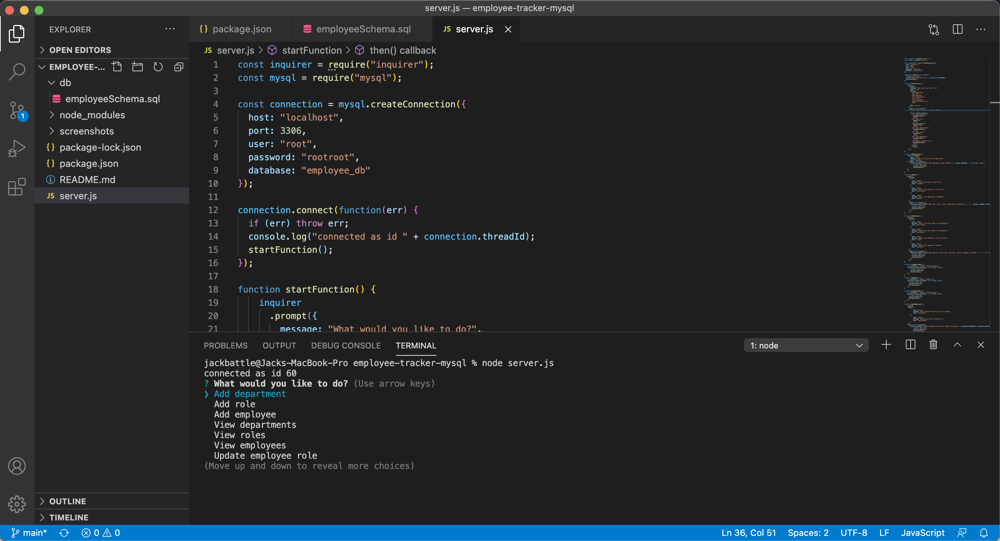
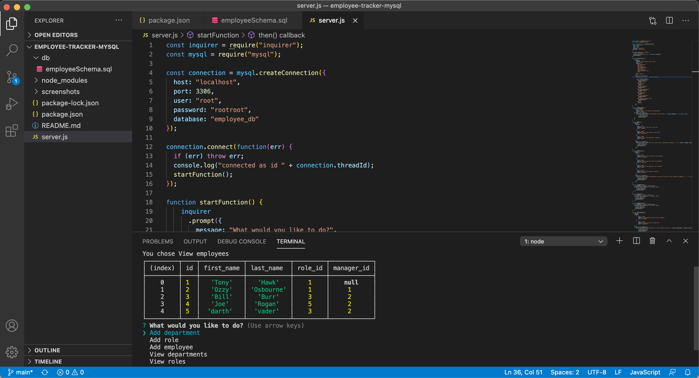
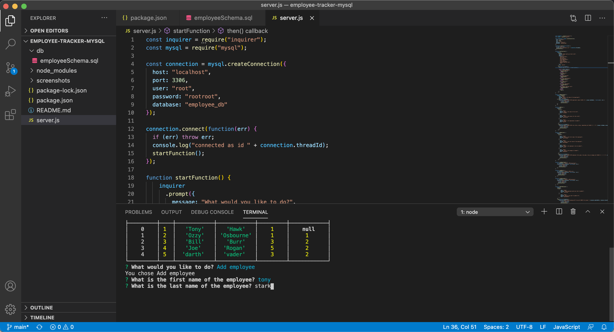

# employee-tracker-mysql

# Description of Project
We were tasked with creating a command line interfaced program to manage employees at a given company. We used MySQL as the database to store our employee data hosted on our machine. 

# Links
Repo Link:
https://github.com/slimeforest/employee-tracker-mysql

Youtube video demonstration:
https://www.youtube.com/watch?v=CafDfHo6GuQ

# Images

